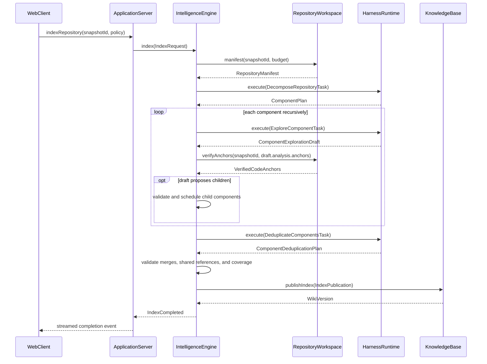
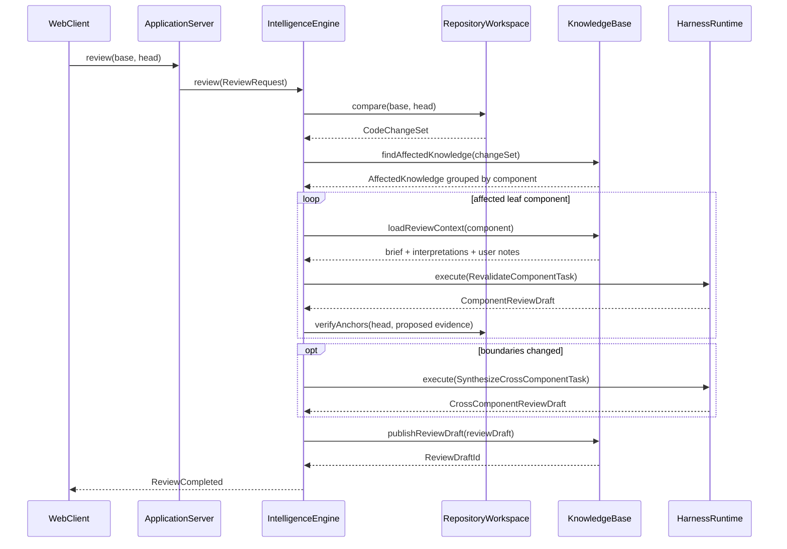

# Know the Map by Bleentr — Component Interaction Traces

> **Status:** Companion proposal to
> [`PROPOSED_ARCHITECTURE.md`](./PROPOSED_ARCHITECTURE.md).
>
> The calls in this document use the interfaces proposed in
> [`INTERFACES.md`](./INTERFACES.md). They show intended ownership and sequencing,
> not final HTTP route names.

## How to read these traces

The application contains six deep modules:

```text
WebClient
ApplicationServer
RepositoryWorkspace
KnowledgeBase
IntelligenceEngine
HarnessRuntime
```

`ApplicationServer` is the composition root. `IntelligenceEngine` orchestrates
AI work but does not read Git, write SQL, or call Pi directly.

Long-running calls return `Stream`s. Effect interruption propagates from the
client request through the engine to active harness sessions. Publications to
the Knowledge Base are atomic: cancellation can leave an `AnalysisRun` record,
but never a half-published wiki.

## Trace 1: Open a repository and capture a snapshot

### User intent

The user opens a local repository. Know the Map resolves its current source state but
does not perform AI analysis yet.

### Call stack

```text
ReviewApi.openRepository(request)
└─ ApplicationServer.openRepository(request)
   ├─ RepositoryWorkspace.open({ root: request.root })
   │  └─ validate root, Git metadata, symlinks, and access policy
   ├─ RepositoryWorkspace.capture(repository.id, request.source)
   │  ├─ resolve Git commit
   │  ├─ hash dirty-worktree files when requested
   │  └─ return Snapshot
   ├─ KnowledgeBase.registerSnapshot(snapshot)
   └─ return OpenRepositoryResult
```

### Important behavior

- `open` establishes the only filesystem root Know the Map may access.
- `capture` returns the same `SnapshotId` for the same reproducible source
  state.
- No model session starts automatically.
- A committed snapshot refers back to Git objects; a dirty snapshot persists
  only the blobs Git cannot reproduce.

## Trace 2: Build the first wiki

### User intent

The user asks Know the Map to map the repository and generate initial component pages.

### Sequence



### Call stack

```text
ReviewApi.indexRepository(request)
└─ ApplicationServer.indexRepository(request)
   └─ IntelligenceEngine.index(request) -> Stream<IndexEvent>
      ├─ RepositoryWorkspace.manifest(snapshotId, manifestPolicy)
      ├─ KnowledgeBase.beginAnalysisRun(metadata)
      ├─ HarnessRuntime.execute(DecomposeRepositoryTask)
      │  └─ PiHarness
      │     ├─ createModelRuntime(modelClass)
      │     ├─ createResourceLoader(approvedResources)
      │     ├─ createAgentSession(SessionManager.inMemory(), tools)
      │     ├─ subscribe(normalizeEvent)
      │     ├─ prompt(structuredTask)
      │     └─ decodeSubmittedResult(resultSchema)
      ├─ validate ComponentPlan
      ├─ exploreComponent(component) recursively
      │  ├─ HarnessRuntime.execute(ExploreComponentTask)
      │  ├─ RepositoryWorkspace.verifyAnchors(snapshotId, proposedAnchors)
      │  ├─ validate component-level evidence and interpretations
      │  └─ validate and schedule proposed children, if any
      ├─ HarnessRuntime.execute(DeduplicateComponentsTask)
      ├─ validate ComponentDeduplicationPlan
      │  ├─ preserve every evidence and interpretation reference
      │  ├─ merge duplicates or record shared references
      │  └─ recheck selector coverage
      ├─ KnowledgeBase.publishIndex(IndexPublication)
      └─ KnowledgeBase.completeAnalysisRun(
           runId,
           { kind: "succeeded", publicationId }
         )
```

### Atomic publication

`IntelligenceEngine` accumulates a validated `IndexPublication`. The Knowledge
Base commits the complete component tree and its interpretations in one
transaction. Until that succeeds, readers continue to see the previous wiki
version.

## Trace 3: Explore and optionally split a component

### User intent

The engine explores a component at its own level. It preserves evidence about the
component boundary and, when further division improves understanding or coverage,
schedules child exploration as well.

### Call stack

```text
IntelligenceEngine.exploreComponent(componentDraft, traversalState)
├─ HarnessRuntime.execute(ExploreComponentTask)
│  └─ return component-level evidence, interpretations, and optional child plan
├─ RepositoryWorkspace.verifyAnchors(snapshotId, proposedAnchors)
├─ retain verified parent evidence whether or not children exist
├─ if marked as leaf:
│  └─ record detailed leaf coverage
└─ if children proposed:
   ├─ assert traversalState remains within depth and task budgets
   ├─ validate child selectors
   │  ├─ children stay inside parent selectors
   │  ├─ overlap remains within policy
   │  └─ no child repeats an ancestor manifest hash
   └─ exploreComponent(child, traversalState.next()) for each child
```

### Division of responsibility

The model decides *how* to divide the component. Know the Map decides whether the
plan is safe and affordable to execute.

The agent cannot create unbounded work. When the recursion or cost budget is
exhausted, the component is published as partial knowledge with an explicit
coverage warning.

```text
Component: Compiler
Coverage: partial
Reason: maximum decomposition depth reached
Unanalysed selectors: src/compiler/optimizer/**
```

## Trace 4: Ask a repository question

### User intent

The user asks a question without sending the entire repository or wiki to the
model.

### Progressive loading

```text
Question
  → component descriptors
  → selected component briefs
  → selected interpretations
  → exact evidence/current code when needed
  → cited answer
```

### Call stack

```text
ReviewApi.ask(request)
└─ ApplicationServer.ask(request)
   └─ IntelligenceEngine.ask(request) -> Stream<AnswerEvent>
      ├─ KnowledgeBase.searchComponents(snapshotId, question, candidateLimit)
      │  └─ return compact ComponentDescriptor[]
      ├─ optionally HarnessRuntime.execute(RouteQuestionTask)
      │  └─ return selected ComponentId[]
      ├─ KnowledgeBase.loadContext(
      │     snapshotId,
      │     selectedComponents,
      │     level = "brief"
      │   )
      └─ HarnessRuntime.execute(AnswerQuestionTask, knowledgeTools)
         ├─ agent may call ktm_load_component(componentId, "interpretations")
         │  └─ KnowledgeBase.loadContext(...)
         ├─ agent may call ktm_read_evidence(anchorId)
         │  ├─ KnowledgeBase.getAnchor(anchorId)
         │  └─ RepositoryWorkspace.readAnchor(anchorId, snapshotId)
         ├─ agent may call ktm_search_knowledge(query)
         │  └─ KnowledgeBase.search(...)
         └─ stream AnswerEvent with EvidenceReference[]
```

### Persistence rule

An answer is not automatically durable wiki knowledge.

```text
ReviewApi.addUserInterpretation({ sourceAnswerId: answerId, ...edits })
└─ ApplicationServer.addUserInterpretation(...)
   └─ KnowledgeBase.addUserInterpretation(...)
      └─ create an explicit, accepted user interpretation
```

This prevents conversational speculation from silently accumulating as
repository truth.

## Trace 5: Detect drift after code changes

### User intent

The user refreshes the wiki after checking out a new commit or modifying the
working tree.

### Call stack

```text
ReviewApi.refreshWiki(request)
└─ ApplicationServer.refreshWiki(request)
   └─ IntelligenceEngine.refresh(request) -> Stream<RefreshEvent>
      ├─ RepositoryWorkspace.capture(repositoryId, targetSource)
      ├─ RepositoryWorkspace.compare(baseSnapshotId, targetSnapshotId)
      │  └─ return CodeChangeSet
      ├─ KnowledgeBase.listActiveInterpretations(baseWikiVersion)
      ├─ RepositoryWorkspace.transitionAnchors(
      │     interpretationAnchorIds,
      │     targetSnapshotId
      │   )
      │  └─ return AnchorTransition[]
      ├─ KnowledgeBase.evaluateFreshness(
      │     baseWikiVersion,
      │     targetSnapshotId,
      │     anchorTransitions
      │   )
      └─ KnowledgeBase.publishFreshness(FreshnessPublication)
```

### Mechanical freshness rules

```text
all direct anchors unchanged                  → current
direct anchors unchanged, component touched  → possibly-affected
one or more direct anchors changed            → stale
anchored code no longer exists                → orphaned
dependency interpretation is stale            → possibly-affected
```

This step is deterministic. It identifies what needs thought; it does not claim
that behavior changed.

## Trace 6: Produce a semantic pull-request review

### User intent

The user reviews the transition from base to head using the base wiki, code
changes, and user annotations.

### Sequence



### Call stack

```text
ReviewApi.review(request)
└─ ApplicationServer.review(request)
   └─ IntelligenceEngine.review(request) -> Stream<ReviewEvent>
      ├─ RepositoryWorkspace.compare(baseSnapshotId, headSnapshotId)
      ├─ RepositoryWorkspace.transitionAnchors(baseAnchors, headSnapshotId)
      ├─ KnowledgeBase.findAffectedKnowledge({ changeSet, transitions })
      ├─ revalidateComponent(group) for each affected component
      │  ├─ KnowledgeBase.loadReviewContext(group)
      │  ├─ HarnessRuntime.execute(RevalidateComponentTask)
      │  ├─ RepositoryWorkspace.verifyAnchors(headSnapshotId, result.anchors)
      │  └─ validate InterpretationChange[]
      ├─ if boundaryImpact.exists:
      │  └─ HarnessRuntime.execute(SynthesizeCrossComponentTask)
      ├─ build ReviewDraft
      └─ KnowledgeBase.publishReviewDraft(reviewDraft)
```

### Input to a component review task

```text
Component descriptor and brief
Base interpretations
User-authored notes and accepted corrections
Mechanical freshness evaluations
Relevant base/head diff
Tools for fetching exact base or head code
Review strategy and output schema
```

### Output from a component review task

```text
Interpretation relations
  preserved · revised · contradicted · obsolete · unknown

New interpretation proposals
  behaviors · invariants · decisions · risks

Questions for the reviewer
Evidence anchors for every important statement
Coverage and unresolved areas
```

## Trace 7: Apply human decisions and promote the head wiki

### User intent

The user reviews generated proposals and decides what becomes durable knowledge.

### Individual decision

```text
ReviewApi.decide(request)
└─ ApplicationServer.decide(request)
   └─ KnowledgeBase.recordDecision({
        reviewDraftId,
        interpretationChangeId,
        decision: "accept" | "correct" | "dismiss" | "defer",
        replacementDraft?,
        user
      })
```

### Promotion

```text
ReviewApi.promoteReview(reviewDraftId)
└─ ApplicationServer.promoteReview(reviewDraftId)
   └─ KnowledgeBase.promoteReview(reviewDraftId)
      ├─ validate head snapshot still matches
      ├─ preserve unchanged accepted interpretations
      ├─ create new immutable interpretation records
      ├─ supersede replaced interpretations
      ├─ retain deferred items as unresolved
      ├─ never discard user notes implicitly
      └─ atomically publish head WikiVersion
```

If the head snapshot changed after the review was generated, promotion fails
with `ReviewOutdated`. The review must be refreshed against the new source.

## Trace 8: Cancellation, failure, and partial coverage

### Client cancellation

```text
WebClient cancels request or closes stream
└─ ApplicationServer interrupts request fiber
   └─ IntelligenceEngine scope closes
      ├─ active HarnessRuntime.execute streams are interrupted
      ├─ PiHarness aborts and disposes active sessions
      ├─ queued component tasks are discarded
      ├─ KnowledgeBase marks AnalysisRun as cancelled
      └─ no IndexPublication or ReviewDraft is published
```

### One component fails

Policy determines whether a component failure aborts the operation or produces
partial coverage:

```text
strict indexing         any component failure aborts publication
exploratory indexing    publish successful components with coverage gaps
semantic review         preserve failed component as unresolved; never imply safe
```

Failures are structured and visible:

```ts
type CoverageGap = {
  componentId: ComponentId
  task: AnalysisTaskKind
  reason: AnalysisFailure
  selectors: ReadonlyArray<PathOrSymbolSelector>
}
```

## Trace 9: Replace the harness without changing the product

```text
IntelligenceEngine.executeTask(task)
└─ HarnessRuntime.execute(task)
   ├─ PiHarness.execute(task)            // first implementation
   ├─ OpenCodeV2Harness.execute(task)    // possible future adapter
   ├─ DirectApiHarness.execute(task)     // possible future adapter
   └─ LocalModelHarness.execute(task)    // possible future adapter
```

All adapters receive Know the Map `AnalysisTask` values and emit the product's
`HarnessEvent` and `AnalysisResult` values. Provider sessions, messages, tokens,
and errors are translated inside the adapter.

This is the principal extensibility seam. Repository, knowledge, and review
semantics do not change when the harness changes.

## Trace 10: Discover flows, then trace one on demand

Opening the Flow Explorer computes only compact descriptors:

```text
WebClient.openFlowExplorer(snapshotId)
└─ ReviewApi.explore({ kind: "discover-flows", snapshotId })
   └─ IntelligenceEngine.explore(request)
      ├─ assert capability was explicitly requested
      ├─ KnowledgeBase.loadContext(snapshotId, level = "brief")
      ├─ RepositoryWorkspace.manifest(snapshotId, entryPointsAndMessagingOnly)
      ├─ HarnessRuntime.execute(DiscoverFlowsTask)
      ├─ validate FlowDescriptor[]
      └─ KnowledgeBase.saveFlowCatalog(snapshotId, descriptors)
```

If 25 flows are discovered, the UI renders 25 descriptors. It does not schedule 25
trace tasks. Selecting one flow starts the expensive pass:

```text
WebClient.selectFlow(flowId)
└─ ReviewApi.explore({ kind: "trace-flow", snapshotId, flowId })
   └─ IntelligenceEngine.explore(request)
      ├─ KnowledgeBase.getFlowDescriptor(flowId)
      ├─ KnowledgeBase.loadContext(likelyComponentIds, level = "brief")
      ├─ HarnessRuntime.execute(TraceFlowTask, boundedKnowledgeTools)
      │  ├─ ktm_read_code(entryPoint)
      │  ├─ ktm_read_code(calledSymbols)
      │  ├─ ktm_read_code(messageProducersAndConsumers)
      │  └─ ktm_submit_flow_trace(steps)
      ├─ RepositoryWorkspace.verifyAnchors(snapshotId, trace.anchors)
      └─ KnowledgeBase.saveFlowTrace(flowId, snapshotId, trace)
```

An example result across service boundaries:

```text
POST /login
└─ ApiGateway.forward(request)
   │  credentials → LoginCommand
   └─ HTTP → AuthService.authenticate(command)
      │  LoginCommand → authenticated User
      ├─ RPC → TokenService.issue(user)
      │  └─ User → signed access claims
      ├─ SessionStore.save(session)
      │  └─ no session → active session
      └─ publish UserLoggedIn
         └─ Session → redacted audit event
```

Calls, RPCs, events, persistence, and transformations are distinct step kinds. Missing
links remain visibly inferred. The saved trace follows the same anchor freshness rules
as every other interpretation.
