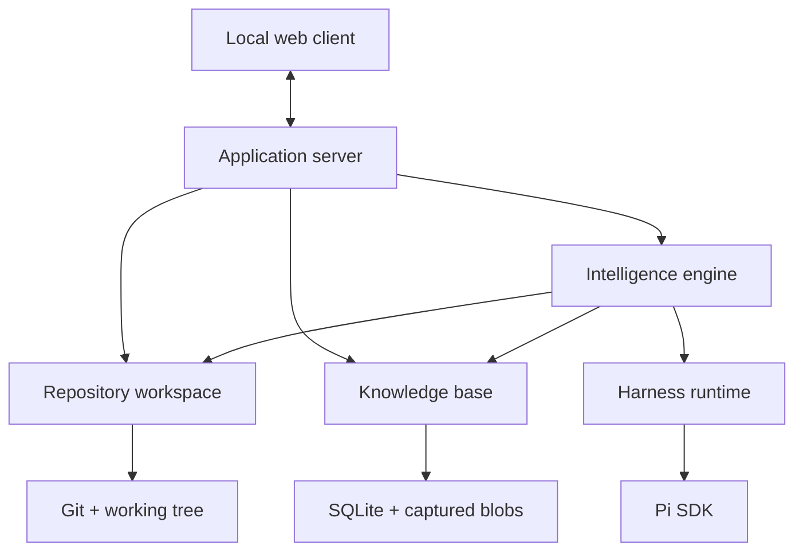

# Know the Map — Proposed Architecture

> **Status:** Proposal for discussion.
>
> [`PRODUCT_PLAN.md`](../../PRODUCT_PLAN.md) defines product scope. This document
> explains only the system structure needed to implement its core loop.

Companion material:

- [`INTERACTION_TRACES.md`](./INTERACTION_TRACES.md) follows operations call by call.
- [`INTERFACES.md`](./INTERFACES.md) contains detailed TypeScript/Effect contracts.
- [GitHub issue #22](https://github.com/nicolasLuduena/know-the-map/issues/22)
  tracks optional product capabilities.

## Architecture at a glance

The core system starts at a chosen repository snapshot, recursively divides the
code into coherent components, and records evidence and interpretations at the
component level where they belong. Leaf components provide detailed coverage, but
divisible parents may still contribute boundary-level knowledge. Later snapshots
transition the evidence anchors and determine which interpretations may no longer
hold.

```text
repository snapshot
  ↓
compact manifest
  ↓
identify top-level components
  ↓
recursively subdivide each component
  ├─ record evidence and interpretations belonging to this level
  └─ continue until further division would not improve understanding
       ↓
     detailed leaf coverage
  ↓
global component reconciliation
  ↓ merge duplicates or create shared references without losing evidence
verified evidence anchors + proposed interpretations
  ↓
human decisions and persisted knowledge

later snapshot
  ↓
anchor transition + freshness evaluation
```

Component discovery is not an optional visualization feature. It is how the
system covers a repository without sending the whole codebase to one agent. A
graphical component map may be optional; the recursive component hierarchy is not.

Pi is the first execution harness. Know the Map owns the recursive task graph,
budgets, schemas, validation, persistence, and user decisions. Pi runs one bounded
model session for each task.

## Architectural invariants

### Evidence and interpretation stay separate

Evidence is reproducible source state or deterministic tool output. An
interpretation is a human or AI claim about what evidence means. Interpretations
never become facts merely because a model is confident.

Every interpretation records its provenance and supporting anchors. User-authored
knowledge may carry more authority than an AI inference, while still losing
freshness if its supporting code changes.

### Time begins at a baseline

Committed snapshots use Git object identities. A dirty-worktree snapshot uses a
reproducible manifest plus captured changed content.

The system begins at a user-selected baseline and tracks forward. It does not need
to rebuild repository history from the first commit.

### Components are mandatory exploration boundaries

A component is a snapshot-scoped region of code with a coherent responsibility.
It may contain child components. The hierarchy exists to divide analysis until a
leaf is small and cohesive enough to explore well.

Component boundaries are AI-proposed and application-validated. They are useful
interpretations of repository structure, not permanent facts baked into domain
identity.

Because components are proposed independently, a global reconciliation pass is
mandatory after recursive exploration. The pass identifies duplicate, overlapping,
or differently named representations of the same responsibility.

### The application orchestrates; the harness executes

An agent may recommend subdividing a component, but it does not create an
unbounded private swarm. The Intelligence Engine validates the proposal and owns
task creation, recursion, concurrency, retries, cancellation, and cost limits.

### Optional analyses remain dormant

The component exploration required to gather core evidence is always active.
Semantic PR synthesis, test-gap analysis, detailed flow tracing, specialized
review lenses, and history exploration run only after explicit user or policy
activation.

### Prefer deep modules

Git commands, SQLite tables, prompt fragments, Pi sessions, and transport details
remain private implementation concerns. The system exposes a few cohesive modules
rather than a service per entity or operation.

## System shape



## Deep modules

### Repository Workspace

The complete source-code boundary. It captures snapshots, builds compact manifests,
computes changes, reads repository-relative code, creates and transitions anchors,
and enforces filesystem boundaries. No agent or other domain module reads arbitrary
paths or invokes Git directly.

### Knowledge Base

The authoritative local store for component hierarchies, anchors, evidence,
interpretations, provenance, freshness, analysis coverage, and human decisions. It
owns transactions and SQLite details.

### Intelligence Engine

The core application brain. It recursively decomposes repository scopes, schedules
component exploration, reconciles duplicate components, assembles bounded context,
validates structured agent results, coordinates freshness revalidation, and activates
optional capabilities only when requested.

### Harness Runtime

The only module that knows Pi or another coding-agent harness. It resolves models,
creates and interrupts sessions, registers bounded tools, normalizes streamed events,
collects schema-bound results, and translates provider failures.

### Application Server

The composition root and local client boundary. It opens repositories, invokes use
cases, maps streams to a versioned protocol, authenticates loopback clients, and owns
graceful startup and shutdown. It contains no repository-analysis logic.

### Local Web Client

Presents evidence beside interpretations, shows provenance and freshness, links to
exact code, and captures human decisions. Rich map, review, and flow surfaces can be
added later without changing the core domain boundaries.

## Recursive component exploration

### Initial decomposition

The Intelligence Engine starts with a compact manifest: directories, selected build
metadata, entry points, languages, and size estimates. A planning task proposes
top-level components with repository-relative selectors and short rationales.

The application rejects a plan when selectors escape the repository, overlap beyond
policy, leave unexplained coverage, or point to code absent from the snapshot.

### Recursive decision

Each accepted component receives its own bounded exploration task. The task may
return evidence and interpretations that belong to that component regardless of
whether it is divisible. It also either marks the component as a leaf or proposes
children because further division would materially improve coverage or
understanding.

Parent-level evidence commonly covers public contracts, entry points, shared
configuration, cross-child relationships, or behavior that emerges at the component
boundary. Child tasks add finer-grained evidence; they do not replace or invalidate
the parent's evidence merely by existing.

The Intelligence Engine validates child selectors, then schedules children as new
tasks. Pi does not recursively spawn them on its own.

```text
explore(component, depth)
  ├─ inspect bounded component context
  ├─ gather evidence belonging to this component level
  ├─ propose anchored component-level interpretations
  ├─ if meaningfully divisible
  │    ├─ propose child components
  │    ├─ validate containment and coverage
  │    └─ explore each child within shared budgets
  └─ otherwise
       └─ record detailed leaf coverage
```

### Leaf criterion

A component is a leaf when:

- it has one coherent responsibility for analysis purposes;
- its relevant code can be inspected within the task's context and tool budget;
- another split would produce artificial file groupings rather than clearer units;
- the agent can ground its important claims in verifiable anchors.

File count or token count alone does not define a leaf. A small directory with two
unrelated responsibilities may need division; a larger cohesive component may not.

Maximum depth, task count, concurrency, and token budgets are hard safety limits. If
a useful leaf cannot be reached within them, the engine records a visible coverage gap
instead of pretending the parent was fully analyzed.

### Coverage

Every non-ignored path in the initial scope must be:

- owned by a leaf component;
- explicitly shared by identified components; or
- recorded as excluded or unresolved with a reason.

This coverage accounting is what makes component decomposition a dependable way to
gather evidence rather than merely generate a plausible architecture diagram.
Evidence may be attached to any component level. Path ownership by a leaf prevents
coverage ambiguity; it does not prohibit a parent interpretation from citing anchors
inside its descendants.

### Global reconciliation

After all recursive tasks finish, the Intelligence Engine gives a deduplication agent
the compact component descriptors, selectors, parent paths, summaries, and evidence
references. It does not need to resend all component code.

The agent proposes one of three outcomes for suspected repetition:

- **merge:** two nodes represent the same responsibility and scope;
- **shared reference:** one real component is legitimately used beneath multiple
  conceptual parents;
- **keep separate:** similar names or code do not represent the same component.

The proposal is advisory. Know the Map validates selector overlap and component
containment, chooses a canonical identity, remaps evidence and interpretations, and
rechecks total coverage before publication. It never discards an anchor, interpretation,
or human note merely because a component was merged.

Ambiguous cases remain separate and are marked for later review. False duplicates are
less damaging than an automatic merge that erases a meaningful boundary.

## Core records

The architecture requires only these concepts:

- **Snapshot:** reproducible repository state at the baseline or a later point.
- **Component node:** snapshot-scoped exploration scope, parent relationship,
  selectors, status, and coverage.
- **Code anchor:** verifiable location and content identity inside a snapshot.
- **Evidence:** observed source or tool output associated with anchors.
- **Interpretation:** human or AI claim supported by evidence and scoped to code.
- **Freshness evaluation:** result of transitioning supporting anchors to a later
  snapshot.
- **Human decision:** acceptance, correction, dismissal, or supersession of an
  interpretation.

Exact identifiers, schemas, and Effect contracts belong in
[`INTERFACES.md`](./INTERFACES.md), not in this architecture overview.

## Baseline indexing interaction

```text
ApplicationServer.index(baseline)
└─ RepositoryWorkspace.capture(baseline)
   └─ IntelligenceEngine.index(snapshot)
      ├─ RepositoryWorkspace.manifest(snapshot)
      ├─ HarnessRuntime.execute(DecomposeRepositoryTask)
      ├─ validate top-level component coverage
      ├─ recursively explore component tasks and verify their anchors
      ├─ HarnessRuntime.execute(DeduplicateComponentsTask)
      ├─ validate reconciliation and remap knowledge
      ├─ recheck coverage after reconciliation
      └─ KnowledgeBase.publishBaseline(
           component hierarchy,
           evidence,
           interpretations,
           coverage
         )
```

Publication is atomic. Cancellation or validation failure may preserve analysis-run
diagnostics, but cannot expose a half-built baseline as complete.

## Forward freshness interaction

```text
ApplicationServer.refresh(target)
└─ RepositoryWorkspace.capture(target)
   ├─ RepositoryWorkspace.transitionAnchors(baseline, target)
   ├─ KnowledgeBase.evaluateFreshness(transitions)
   ├─ show mechanical freshness immediately
   └─ revalidate selected affected interpretations when requested
```

Unchanged anchors preserve freshness. Changed or missing anchors reduce it. AI
revalidation is separate from mechanical detection and is not required merely to show
that knowledge may be stale.

## Bounded agent context

Agents never receive the whole repository by default. The Intelligence Engine exposes
progressive context and repository-relative tools:

```text
manifest       names, paths, sizes, entry points, build metadata
component      selector, rationale, nearby relationships, child descriptors
evidence       exact code anchors and deterministic tool output
```

Typical tools include bounded code reads, symbol or text search, component context
loading, evidence reads, and one task-specific result-submission tool. Write, edit, and
shell tools are disabled for background analysis.

## Pi integration

`PiHarness` embeds Pi's public TypeScript SDK:

```text
execute(task, context)
  → resolve provider and model
  → create AgentSession with SessionManager.inMemory()
  → load explicitly approved resources
  → register bounded read and result-submission tools
  → stream normalized events
  → validate the submitted result schema
  → abort on interruption and always dispose
```

One session corresponds to one application-owned task. Pi session, message, tool, and
provider types never cross the Harness Runtime boundary.

OpenCode and other harnesses remain possible later adapters. Building a native agent
runtime is outside the MVP.

References:

- [Pi documentation](https://pi.dev/docs/latest)
- [Pi SDK](https://pi.dev/docs/latest/sdk)
- [Pi skills](https://pi.dev/docs/latest/skills)

## Persistence and deployment

The MVP uses one SQLite database owned by the Knowledge Base. Git remains the source
for committed code; dirty snapshots capture only the changed content needed to
reproduce their manifest.

The CLI starts one loopback-only application server and serves the local web client.
There is no distributed worker system, graph database, or hosted synchronization in
the core architecture.

## Security invariants

- Bind the application server to loopback and authenticate clients.
- Restrict repository operations to an explicitly opened root.
- Resolve symlinks and reject traversal outside that root.
- Exclude secrets rather than sending every repository file by default.
- Show the selected harness, model, remote/local boundary, and activated capability.
- Validate every agent-produced selector, path, anchor, and structured result.
- Give background agents read-only, least-privilege tools.

## MVP architecture slice

The first implementation supports:

1. one repository and a chosen baseline snapshot;
2. recursive, budgeted component decomposition;
3. evidence gathering at parent and leaf component levels with verified anchors;
4. global component deduplication and reconciliation;
5. complete or explicitly qualified leaf coverage after reconciliation;
6. human and Pi-generated interpretations tied to those anchors;
7. a later snapshot and mechanical freshness evaluation;
8. a minimal UI for inspecting evidence and acting on interpretations.

Deferred capabilities are tracked in
[GitHub issue #22](https://github.com/nicolasLuduena/know-the-map/issues/22).

## Open architectural decisions

- The initial component leaf heuristic and default decomposition budgets.
- The similarity threshold for proposing component reconciliation candidates.
- How shared code is represented without silently duplicating coverage.
- Whether AI interpretations begin proposed or accepted-with-an-AI-label.
- How repository-wide human notes inherit when component boundaries change.
- Whether SQLite full-text search is sufficient for initial context retrieval.
