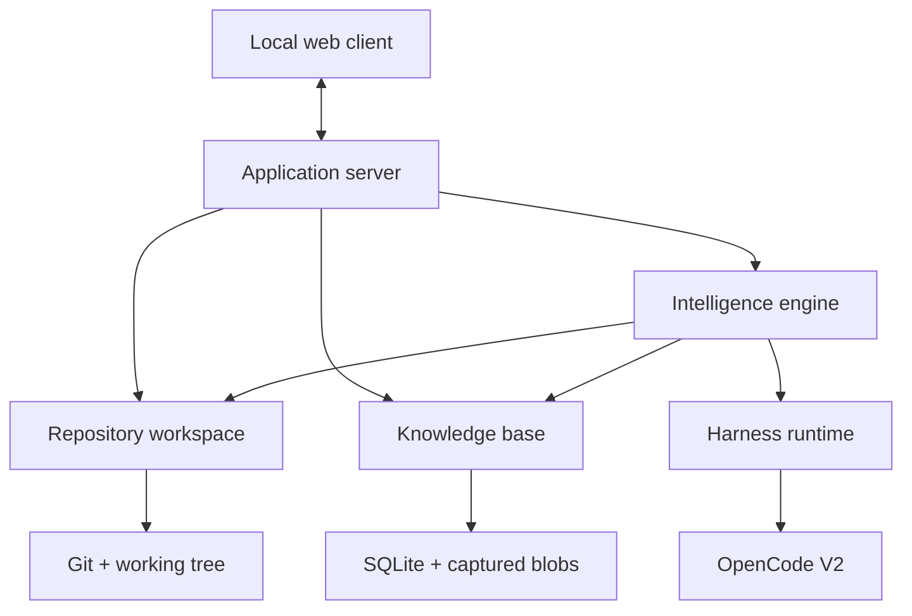

# Know the Map by Bleentr — Proposed Local Wiki Architecture

> **Status:** Proposal for discussion.
>
> This document refines the product direction in
> [`PRODUCT_PLAN.md`](../../PRODUCT_PLAN.md) into a smaller implementation model.
> The product thesis in `PRODUCT_PLAN.md` remains authoritative where the two
> documents differ.

Companion documents:

- [`INTERACTION_TRACES.md`](./INTERACTION_TRACES.md) follows the important
  workflows call by call.
- [`INTERFACES.md`](./INTERFACES.md) proposes the TypeScript/Effect contracts and
  ownership rules.

## Decision summary

Know the Map is a local, AI-maintained repository wiki with semantic code review
built on top of the same knowledge.

The wiki stores two fundamentally different kinds of knowledge:

1. **Evidence** — exact, reproducible facts about a repository snapshot.
2. **Interpretations** — human or AI-authored statements about what that
   evidence means.

Every interpretation is scoped to code. When that code changes, Know the Map can
identify which interpretations may no longer hold, revalidate them, and explain
the semantic impact of a pull request.

```text
Wiki at base revision
        +
     code change
        ↓
semantic review
        ↓
human accepts, corrects, or rejects proposed knowledge
        ↓
Wiki at head revision
```

OpenCode V2 is the first execution harness. Know the Map owns repository
snapshots, knowledge, decomposition, task orchestration, freshness, and user
decisions. OpenCode owns model sessions, tools, subagents, provider selection,
and streamed execution.

## Design principles

### Evidence and interpretation never collapse into one value

Code is not prose, and generated prose is not code truth. An interpretation may
be useful, accepted, and current without becoming hard evidence.

Know the Map records these dimensions separately:

- **Origin:** deterministic tool, AI, or user.
- **Freshness:** current, possibly affected, stale, or orphaned.
- **Lifecycle:** proposed, accepted, superseded, or dismissed.
- **Assurance:** observed, inferred, or unverified.

A user note may have greater product authority than an AI inference while still
being stale because its code changed. A current AI inference may still be
unaccepted. The UI must not compress those differences into one opaque
confidence score.

### Git defines source time

Committed snapshots use Git object IDs. A dirty working tree uses a manifest
hash plus captured content for changed files. Wall-clock ingestion time is
operational metadata, not the identity of source state.

### Components are useful interpretations, not permanent facts

AI proposes a component hierarchy from the repository tree and current code.
Users may rename, reshape, split, merge, or lock components. Each component
version is tied to a snapshot and a manifest of the code it covers.

### The application orchestrates; the harness executes

The planning model may decide that a component needs subdivision, but Know the Map owns
the bounded task graph. It enforces recursion depth, concurrency, cost limits,
permissions, cancellation, retries, and result validation.

### Prefer deep modules

Know the Map should have a few modules that each hide meaningful complexity. Storage
tables, Git commands, prompt fragments, OpenCode sessions, and HTTP endpoints
are implementation details behind those modules rather than packages of their
own.

### Extensibility comes from narrow seams

The core is extensible through a small number of explicit adapters and
strategies. It does not expose arbitrary lifecycle hooks or make every internal
class replaceable.

## System shape



## Deep modules

### 1. Repository Workspace

`RepositoryWorkspace` is the complete source-code boundary.

It owns:

- discovering and validating a repository root;
- capturing committed and dirty-worktree snapshots;
- resolving base and head revisions;
- computing changed paths and hunks;
- reading code by snapshot, path, symbol, or anchor;
- hashing anchor contents and surrounding context;
- relocating anchors across snapshots where possible;
- enforcing repository-root and symlink boundaries.

Consumers do not run Git or read arbitrary filesystem paths themselves.

### 2. Knowledge Base

`KnowledgeBase` is the authoritative store for the local wiki.

It owns:

- component hierarchies and component versions;
- code anchors and evidence records;
- AI and user interpretations;
- interpretation dependencies and supersession;
- freshness evaluation across snapshots;
- analysis-run provenance;
- review drafts and human decisions;
- full-text knowledge search;
- transactional persistence and schema migrations.

The first implementation uses SQLite internally. Callers do not operate on
tables or choose persistence transactions.

### 3. Intelligence Engine

`IntelligenceEngine` owns every AI-assisted use case.

It owns:

- initial repository decomposition;
- recursive subdivision of oversized components;
- per-component interpretation tasks;
- component routing for user questions;
- progressive context loading;
- interpretation revalidation after code changes;
- semantic base/head review;
- cross-component synthesis;
- cost, depth, concurrency, and task budgets;
- validation of structured harness results.

Scheduling is an internal concern of this module until there is a demonstrated
need for a separately deployable worker system.

### 4. Harness Runtime

`HarnessRuntime` is the only module that knows how a coding-agent harness works.

It owns:

- starting or attaching to a harness service;
- creating and interrupting task sessions;
- configuring models, agents, and read-only permissions;
- streaming normalized execution events;
- collecting and validating structured task results;
- translating provider and harness failures into domain errors.

The first adapter is `OpenCodeV2Harness`, using the public V2 server/client
boundary. The not-yet-public embedded SDK can replace its internals later.

### 5. Application Server

`ApplicationServer` is the composition root and client boundary.

It owns:

- opening repositories and review workspaces;
- invoking the three domain modules;
- mapping long-running streams to client events;
- authenticating loopback clients;
- exposing a versioned HTTP/WebSocket protocol;
- keeping UI sessions and ephemeral view state separate from knowledge;
- graceful startup and shutdown.

It contains no repository analysis logic.

### 6. Local Web Client

The web client renders structured knowledge and review state.

Its initial surfaces are:

- component tree and component pages;
- responsibility, behavior, flow, invariant, risk, and note cards;
- evidence links into exact code;
- origin, freshness, lifecycle, and assurance badges;
- repository question box;
- base/head semantic review;
- accept, correct, supersede, dismiss, and refresh actions.

The client never decides whether an interpretation is fresh and never builds
model prompts.

## Core domain model

### Snapshot

A snapshot identifies the exact source state against which evidence and
interpretations were produced.

```ts
type Snapshot = {
  id: SnapshotId
  repositoryId: RepositoryId
  source:
    | { kind: "git"; commit: GitObjectId }
    | { kind: "worktree"; base: GitObjectId; manifestHash: Hash }
  createdAt: DateTime
}
```

### Code anchor

A code anchor ties knowledge to a source scope and stores enough identity to
detect drift.

```ts
type CodeAnchor = {
  id: CodeAnchorId
  snapshotId: SnapshotId
  scope:
    | { kind: "repository" }
    | { kind: "path"; path: RepoPath }
    | { kind: "symbol"; path: RepoPath; symbol: string }
    | { kind: "range"; path: RepoPath; start: number; end: number }
  contentHash: Hash
  contextHash?: Hash
}
```

Repository and component-level statements use broader anchors. Precise
behavioral claims should prefer symbol or range anchors.

### Component

`ComponentId` is a logical wiki identity. `ComponentVersion` is the component's
definition at one snapshot.

```ts
type ComponentVersion = {
  id: ComponentVersionId
  componentId: ComponentId
  snapshotId: SnapshotId
  parentId?: ComponentId
  name: string
  description: string
  selectors: ReadonlyArray<PathOrSymbolSelector>
  manifestHash: Hash
  brief: string
  origin: "ai" | "user"
  lockedByUser: boolean
}
```

### Interpretation

Interpretations are immutable records. Corrections and updates create a new
record connected by `supersedes`.

```ts
type Interpretation = {
  id: InterpretationId
  componentId: ComponentId
  kind:
    | "responsibility"
    | "behavior"
    | "flow"
    | "invariant"
    | "decision"
    | "risk"
    | "note"
  body: string
  author: InterpretationAuthor
  assurance: "observed" | "inferred" | "unverified"
  basedOn: ReadonlyArray<CodeAnchorId>
  dependsOn: ReadonlyArray<InterpretationId>
  supersedes: ReadonlyArray<InterpretationId>
  createdAtSnapshot: SnapshotId
  lifecycle: "proposed" | "accepted" | "superseded" | "dismissed"
}
```

### Freshness evaluation

Freshness is derived for an interpretation relative to a target snapshot. It is
not mutated into the interpretation itself.

```ts
type InterpretationFreshness = {
  interpretationId: InterpretationId
  targetSnapshotId: SnapshotId
  state: "current" | "possibly-affected" | "stale" | "orphaned"
  affectedAnchors: ReadonlyArray<AnchorTransition>
  reason: string
}
```

### Semantic interpretation change

AI revalidation proposes what a code change means for existing knowledge.

```ts
type InterpretationChange = {
  id: InterpretationChangeId
  baseInterpretationId?: InterpretationId
  proposedHeadInterpretation?: InterpretationDraft
  relation:
    | "preserved"
    | "strengthened"
    | "weakened"
    | "revised"
    | "contradicted"
    | "obsolete"
    | "unknown"
    | "introduced"
  baseEvidence: ReadonlyArray<CodeAnchorId>
  headEvidence: ReadonlyArray<CodeAnchorId>
  explanation: string
}
```

Interpretation changes remain review-draft data until a human decision promotes
them into the head wiki.

## Repository indexing

Initial indexing is AI-led but application-bounded:

1. Repository Workspace creates a snapshot and compact repository manifest.
2. Intelligence Engine asks a planner agent for a structured component plan.
3. It validates paths, overlap, coverage, estimated size, and task budget.
4. Components below the size limit receive an analyst task.
5. Oversized components receive another bounded decomposition task.
6. Analyst tasks return component briefs and interpretation drafts with anchors.
7. Repository Workspace verifies every anchor against the snapshot.
8. Knowledge Base commits the component tree, evidence, and proposed
   interpretations atomically.

The agent may request more code while working. It does not receive the entire
repository by default.

## Skill-like context loading

Know the Map exposes repository knowledge progressively:

```text
Level 0 — component descriptor
          name, description, selectors, keywords

Level 1 — component brief
          responsibilities, public surface, relationships

Level 2 — interpretations
          flows, invariants, decisions, risks, user notes

Level 3 — evidence and current code
          exact anchors, source, diff, related code
```

Question routing starts with Level 0. The answering task loads deeper levels
only for likely components. Large component trees are hierarchical: loading a
parent reveals its child descriptors.

OpenCode V2 skills are a promising delivery mechanism because their descriptions
can be advertised separately from their bodies. Know the Map may initially
implement the same behavior through explicit knowledge tools, then expose dynamic
native skills when that integration is stable.

## Semantic code review

A PR review compares the base wiki with the head code:

1. Capture base and head snapshots.
2. Compute the code change set.
3. Evaluate existing anchors against the head snapshot.
4. Group affected interpretations by component.
5. Run one revalidation task per affected leaf component.
6. Run cross-component synthesis only when component boundaries or relationships
   changed.
7. Produce a review draft containing interpretation changes, new
   interpretations, risks, and questions.
8. Let the user accept, correct, dismiss, or defer each proposal.
9. Apply accepted decisions to produce the head wiki.

Hunks remain evidence and navigation targets. The user-facing unit is the change
to the system's understood behavior, structure, or assumptions.

## Persistence

The first implementation should use one SQLite database owned entirely by the
Knowledge Base. Expected internal tables include:

```text
repositories              snapshots
code_anchors              component_versions
interpretations           interpretation_evidence
interpretation_links      freshness_evaluations
analysis_runs             analysis_tasks
review_drafts             interpretation_changes
user_decisions            schema_migrations
```

SQLite FTS indexes component descriptions, briefs, and interpretation bodies.
Git remains the source for committed code. Dirty-worktree snapshots store only
the changed blobs required to reproduce their manifest.

This is deliberately not a general event-sourcing system. Interpretations and
human decisions are append-only where auditability matters; query state is
materialized directly in SQLite.

## OpenCode V2 integration

The initial integration uses the public OpenCode V2 service and generated
TypeScript client:

```text
OpenCodeV2Harness.execute(task, context)
  → ensure or attach to service internally
  → create session at repository location
  → configure task agent and read-only permissions
  → prompt with the `AnalysisTask` envelope
  → stream normalized events
  → receive structured result
  → validate anchors and result schema
```

Know the Map defines the task/result schemas. OpenCode session, message, tool, and model
types must not leak into the domain modules.

Agents used for indexing and review deny edits. Shell access is denied by
default or restricted to explicitly allowed read-only commands. Know the Map supplies
repository and knowledge access through bounded tools.

References:

- [OpenCode V2 client](https://opencode.ai/v2/docs/build/client)
- [OpenCode V2 SDK](https://opencode.ai/v2/docs/build/sdk)
- [OpenCode V2 permissions](https://opencode.ai/v2/docs/permissions)
- [OpenCode V2 skills](https://opencode.ai/v2/docs/skills)

## Extensibility model

The initial stable seams are:

1. **Harness adapters** — OpenCode V2 first; other agent runtimes later.
2. **Review strategies** — general, security, performance, or
   repository-specific interpretation guidance.
3. **Knowledge persistence** — SQLite first, replaceable behind one deep
   persistence interface if a real need emerges.
4. **Repository sources** — local Git first, remote or hosted materialization
   later.

Extensions contribute structured behavior and declared capabilities. They do
not replace domain identity, anchor validation, freshness rules, permission
boundaries, user-decision semantics, or protocol versioning.

## Security invariants

- Bind the web service to loopback by default and authenticate every client.
- Restrict every repository operation to an explicitly opened root.
- Resolve symlinks and reject traversal outside the root.
- Give analysis agents read-only permissions.
- Never include secret files merely because they are beneath the repository.
- Show the selected harness, model, context, and remote/local boundary.
- Do not send the entire repository to a model by default.
- Treat harness output as untrusted structured input and validate every path and
  anchor.

## MVP

The first useful release should support:

1. Open one local Git repository.
2. Capture a committed or dirty-worktree snapshot.
3. Produce a recursive component map through OpenCode V2.
4. Generate component briefs and anchored interpretation cards.
5. Browse the local wiki and exact supporting code.
6. Ask questions using progressive component loading.
7. Compare two snapshots and mark affected interpretations.
8. Generate a component-oriented semantic review.
9. Accept, correct, dismiss, and persist proposed interpretations.
10. Refresh only affected components after a code change.

Deferred until the loop is useful:

- multiple languages beyond what agents can inspect directly;
- a dedicated graph database;
- generalized event sourcing;
- distributed workers;
- full repository-history indexing;
- collaborative hosted synchronization;
- autonomous approval;
- automatic edits to the reviewed repository.

## Open decisions

- Whether the first UI uses Svelte, React, or another local web stack.
- The exact component size and recursion budgets.
- Whether AI interpretations begin as proposed or are auto-accepted with a clear
  AI label.
- How user-authored repository-wide notes inherit across snapshots.
- Whether component retrieval begins with SQLite FTS alone or FTS plus
  embeddings.
- Which inexpensive model provides acceptable decomposition and routing quality.
