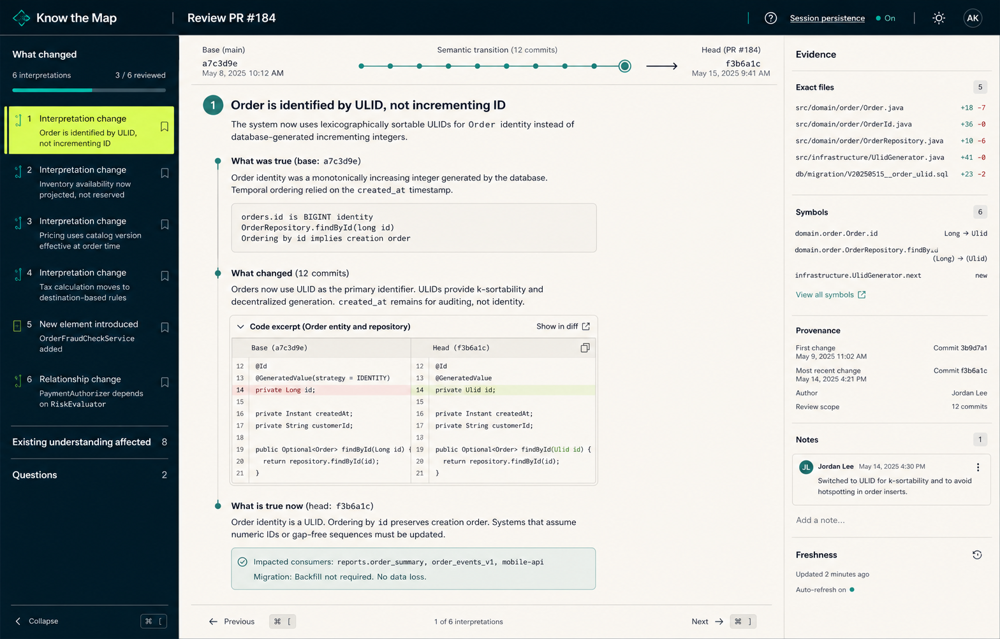
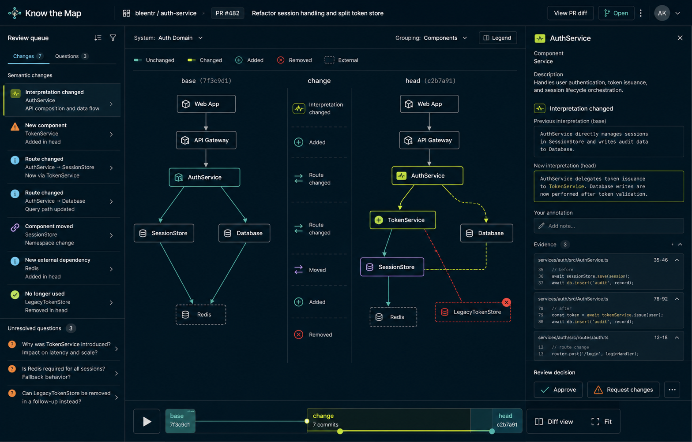
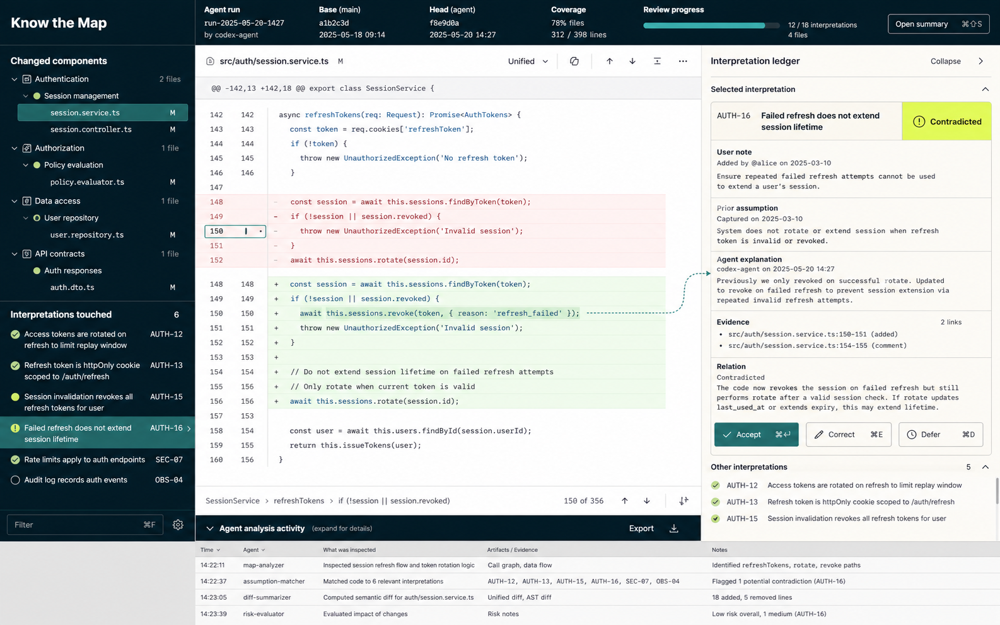

# Know the Map by Bleentr — Review UI Options

> **Status:** Design exploration. These probes test interaction hierarchy and
> information architecture; they are not implementation specifications.
>
> Product context: [`PRODUCT.md`](../../PRODUCT.md)

## Product framing

Know the Map should be a standalone local web application served by the CLI.
The CLI owns repository access and analysis; the browser provides the space
needed to move between system understanding, code evidence, and review
decisions.

The primary review object is not a hunk or an AI finding. It is a change to the
reviewer's understanding of the system:

```text
what we believed at base
        ↓
what code changed
        ↓
what appears true at head
        ↓
what the reviewer accepts, corrects, or leaves unresolved
```

Two entry contexts use the same product:

1. **PR review** — orient to a proposed transition and decide whether it is
   safe and understandable.
2. **Agent-run review** — inspect freshly generated code while the agent's
   intent and activity are still available.

## Visual foundation

The committed Know the Map identity already establishes the lane:

- Paper `#F5F1E8` for calm reading surfaces.
- Deep Ink `#0B1F2A` for structure, navigation, and primary text.
- Mineral `#2F7F78` for stable relationships and secondary focus.
- Fog `#DDE5E2` for boundaries and quiet supporting regions.
- Signal `#C7F23D` for one current change or focus—not a general decoration.
- Inter for product language; JetBrains Mono for code, symbols, paths, and
  revisions.

The interface should feel technical and editorial rather than futuristic. Use
continuous work regions, dividers, and disclosure instead of stacking every
fact into a rounded card.

## Shared application shell

All options use the same stable shell:

```text
┌────────────────────────────────────────────────────────────────────┐
│ Repository · review source · base → head · coverage · harness     │
├────────────────┬───────────────────────────────────┬───────────────┤
│ Review queue   │ Active lens                       │ Inspector     │
│                │ Story · Map · Code                │               │
│ changes        │                                   │ interpretation│
│ questions      │                                   │ evidence      │
│ user notes     │                                   │ decisions     │
├────────────────┴───────────────────────────────────┴───────────────┤
│ Optional analysis activity / coverage / task details              │
└────────────────────────────────────────────────────────────────────┘
```

### Global header

The header answers five questions without becoming a dashboard:

- Which repository am I reviewing?
- Where did this change come from: PR, agent run, commit range, or worktree?
- What are base and head?
- Is analysis complete enough to trust the review coverage?
- Which harness/model boundary is active?

### Review queue

The left rail is a decision queue, not a file tree by default. It groups:

- changed interpretations;
- introduced components or relationships;
- user notes that may have been violated;
- unresolved questions;
- coverage gaps.

Files remain available as a secondary grouping in Code mode.

### Inspector

The right side preserves context across all lenses:

- selected interpretation or semantic change;
- origin, assurance, freshness, and lifecycle;
- previous and proposed wording;
- user notes and corrections;
- exact evidence;
- accept, correct, dismiss, or defer actions.

Changing lenses must not discard the current selection or scroll the reviewer
back to the beginning.

## Option A: Editorial review brief



### Idea

Treat the semantic review as a carefully structured technical brief. The main
column walks through what was true, what changed, and what appears true now.
Code excerpts and evidence expand inline when needed.

### Layout

```text
Review queue | semantic narrative | evidence rail
```

The center behaves like a sequence of review chapters rather than a feed of
findings. Each chapter represents one interpretation transition.

### Primary interaction

The reviewer moves through interpretation changes with `j`/`k` or next/previous,
expands evidence inline, and records a decision before moving on.

### Best for

- Understanding unfamiliar PRs.
- Architectural or behavioral changes.
- Reviewers who need orientation before code inspection.
- Sharing a concise review narrative with another engineer.

### Strengths

- Makes the semantic transition legible.
- Gives user notes and existing understanding equal standing with new analysis.
- Naturally separates observation, interpretation, and question.
- Produces a useful review summary almost as a side effect.

### Risks

- Can hide the true size or messiness of the code change.
- Long PRs may become a generated essay.
- Weak evidence selection would make it feel authoritative without being
  inspectable.

### Guardrails

- Keep chapters short and structured.
- Put exact evidence one action away.
- Always expose coverage gaps and unreviewed code.
- Let reviewers jump directly into Code mode at the same selected anchor.

## Option B: Topology-first review



### Idea

Make the system transition spatial. The center compares the base architecture
with the head architecture and shows which components or routes were added,
removed, moved, or reinterpreted.

### Layout

```text
Review queue | base → change → head topology | selected-node inspector
```

A temporal scrubber can switch between base, transition, and head without
requiring three unrelated canvases.

### Primary interaction

Selecting a semantic change highlights its affected nodes and routes. Selecting
a node explains the changed interpretation and exposes code evidence in the
inspector.

### Best for

- Architectural refactors.
- Dependency and data-flow changes.
- Stacked PRs and feature trajectories.
- Repository exploration outside a specific PR.

### Strengths

- Most differentiated from ordinary review tools.
- Reveals cross-file and cross-component impact quickly.
- Gives the “map” in Know the Map literal product meaning without decorative
  map imagery.
- Makes before/after structure memorable.

### Risks

- Graphs become unusable when every symbol is visible.
- A misleading inferred edge can visually overstate certainty.
- It is a poor default for small or mechanical changes.
- Canvas interaction and accessibility are significantly harder than ordinary
  document navigation.

### Guardrails

- Show components and important relationships, not every symbol.
- Use deterministic structure where possible and label inferred edges.
- Provide an equivalent keyboard-accessible outline.
- Treat topology as a lens, never the only way to access review information.

## Option C: Code-first interpretation ledger



### Idea

Keep code primary and place the semantic model beside it. The reviewer reads a
familiar diff while an interpretation ledger explains which established beliefs
or user notes the selected lines affect.

### Layout

```text
component/file outline | code diff | interpretation ledger
                       analysis activity drawer
```

### Primary interaction

Selecting changed lines highlights the related interpretations. Selecting an
interpretation moves the diff to its supporting code. The relationship is
bidirectional.

### Best for

- Reviewing code immediately after an agent finishes.
- Focused implementation changes.
- Reviewers already familiar with the repository.
- Cases where exact code correctness matters more than initial orientation.

### Strengths

- Familiar and fast for experienced code reviewers.
- Makes user notes and prior assumptions operational at the exact changed line.
- Keeps agent activity available without turning the interface into a chat log.
- Lowest adoption cost of the three options.

### Risks

- Can regress into a conventional diff viewer with AI prose attached.
- Cross-component meaning is less visible.
- The wiki may feel secondary instead of being the basis of the review.

### Guardrails

- Group the queue by semantic component before file.
- Present interpretation relations, not generic AI comments.
- Keep “Story” one keystroke away for orientation.
- Only show agent activity when requested or when coverage is incomplete.

## Comparison

| Quality | Editorial brief | Topology-first | Code-first ledger |
| --- | --- | --- | --- |
| Fast orientation | Excellent | Good | Fair |
| Exact code review | Good | Fair | Excellent |
| Architectural impact | Good | Excellent | Fair |
| Familiarity | Good | Fair | Excellent |
| Small changes | Good | Poor | Excellent |
| Large unfamiliar PRs | Excellent | Good | Fair |
| Agent-run review | Good | Fair | Excellent |
| Accessibility cost | Moderate | High | Moderate |
| Differentiation | Strong | Very strong | Moderate |

## Recommended direction: one workspace, three lenses

Use one review model with three synchronized lenses:

```text
Story   semantic transition and review narrative
Map     system structure and relationship changes
Code    exact diff and source evidence
```

The review queue, selection, inspector, decisions, and progress remain stable
while the center lens changes.

### Context-sensitive starting lens

```text
Unfamiliar or substantial PR       → Story
Architectural relationship change  → Map, with Story summary
Fresh agent run or small patch      → Code
Repository exploration             → Map or Story
```

This should be a recommendation, not a forced mode. The user's most recent lens
choice is remembered per repository and review type.

### Why not choose only one?

The product has three irreducible review questions:

1. What does this change mean?
2. Where does it alter the system?
3. What exact code supports that conclusion?

Story, Map, and Code answer those questions with different spatial grammars.
Trying to combine all three into one permanent canvas would create a dense,
unreadable dashboard.

## PR review flow

```text
1. Open review
   Show base/head, analysis coverage, and the five most consequential changes.

2. Orient in Story
   Read the system-level transition and select the first changed interpretation.

3. Inspect
   Open Map for structural impact or Code for exact evidence without losing the
   selected interpretation.

4. Decide
   Accept, correct, dismiss, or defer the proposed interpretation change.

5. Resolve questions
   Work through open questions and user notes that may have been violated.

6. Finish review
   See decided, unresolved, and uncovered areas; export or hand off the semantic
   review. Know the Map does not issue an autonomous approval verdict.
```

## Agent-run review flow

```text
1. Agent finishes
   The CLI captures the before/after snapshots and records available run metadata.

2. Open in Code
   Focus the first changed component and show interpretations touched by the
   selected lines.

3. Verify intent
   Compare the agent's explanation with existing user notes and accepted
   interpretations.

4. Investigate impact
   Switch to Story or Map when a local change affects a wider behavior or route.

5. Decide knowledge changes
   Accept or correct proposed interpretations independently from accepting the
   code itself.

6. Return to the coding workflow
   Export unresolved questions or evidence locations back to the agent/editor.
```

## CLI-served application

The standalone topology is appropriate:

```text
CLI command
  → start or attach to local service
  → capture repository snapshot
  → create review workspace
  → open authenticated loopback URL
  → stream analysis and review events
```

Illustrative entry points:

```sh
# Review a PR or commit range
ktm review main...feature/session-store

# Review the current working tree after an agent run
ktm review --worktree

# Explore the current repository wiki
ktm open
```

The product name is Know the Map by Bleentr; the binary and command prefix are
`ktm`.

The browser is a client of the local service. Refreshing or opening another tab
does not start duplicate analysis. Source files are loaded on demand, and the UI
shows which model or remote provider receives selected context.

## Key states

### Analysis in progress

Show useful partial structure immediately. Skeleton only the regions that are
actually unavailable. Mark unfinished components as “Analysis pending”; do not
fill the interface with spinners.

### Partial coverage

Coverage gaps stay visible in the queue and final review summary. Failed or
unanalysed areas cannot silently disappear.

### Head changed

If new commits arrive or the worktree changes, freeze decisions against the old
snapshot and show a persistent “Review is out of date” action. Never merge old
and new evidence silently.

### Harness unavailable

Keep the existing wiki and deterministic diff usable. Explain which semantic
operations are unavailable and how to reconnect; do not replace the entire app
with an error page.

### No semantic change

For mechanical changes, say so plainly and keep the review compact. Provide
evidence and affected references without manufacturing architectural drama.

### No existing wiki

Offer to map the repository, explain the expected scope and model boundary, and
allow a code-only review while indexing proceeds.

## Interaction and accessibility

Core keyboard model:

```text
j / k             next / previous review item
1 / 2 / 3         Story / Map / Code
Enter             open selected evidence or interpretation
e                 show evidence
a / c / d         accept / correct / defer
Cmd/Ctrl+K        command palette
?                 shortcut reference
```

- Every graph operation has an equivalent outline or list operation.
- Focus never moves merely because streamed analysis arrives.
- Signal color always appears with an icon, label, or selection shape.
- Diff colors meet contrast requirements and do not reuse Signal.
- At 200% zoom, the inspector becomes a drawer and the queue remains navigable.
- Below desktop width, use one active region at a time rather than compressing
  three panes into unusable columns.
- Motion communicates selection, lens transitions, and newly available results;
  reduced-motion mode uses instant state changes or short crossfades.

## Recommendation to validate first

Prototype the shared shell with **Story and Code** synchronized around one
selected interpretation. That tests the unique product loop with much less risk
than building the topology canvas first.

Add Map after the component model is reliable enough that its edges are useful
rather than decorative. The topology probe should guide the eventual lane, but
it should not become an MVP dependency.

## Decisions to confirm

1. Whether the shared three-lens workspace is the intended product direction.
2. Whether PR review should default to Story and agent-run review to Code.
3. Whether Map is an MVP lens or a follow-on after Story/Code validate the
   knowledge model.
