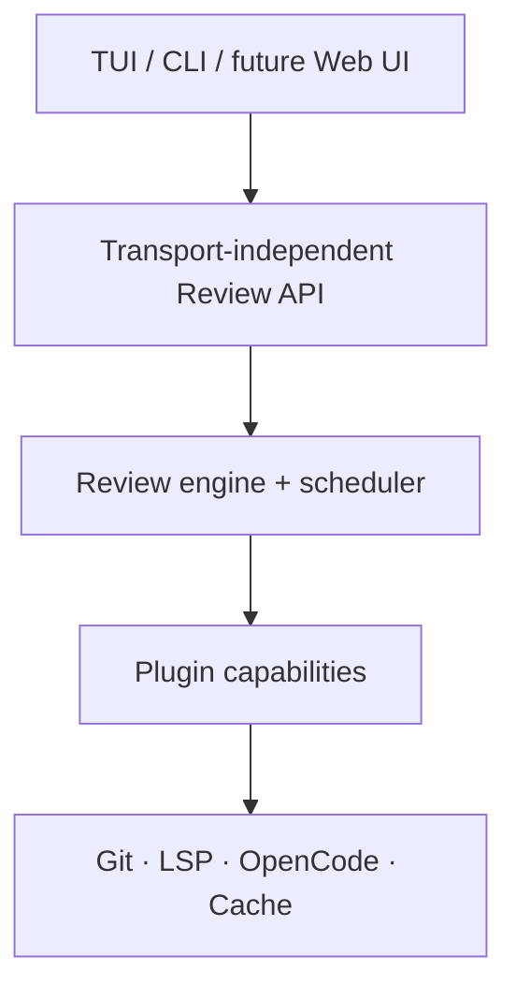
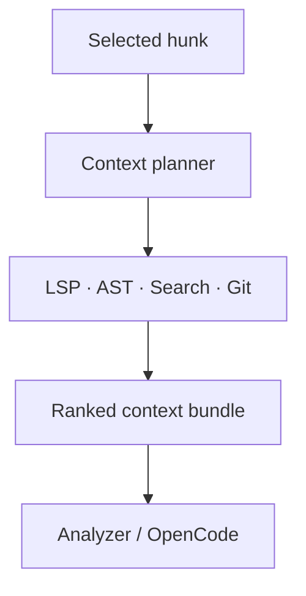

# What the Hunk? — Architecture

## Overview

What the Hunk? is a headless, stateless diff-analysis engine built from stable domain primitives and replaceable capabilities. Its terminal UI is one client of the engine rather than the application itself.

The architecture follows one central rule:

> Keep domain values and invariants stable; make integrations, policies, and behaviors customizable.

For example, `Hunk`, `DiffSnapshot`, and `ReviewFinding` are core types. How a diff is obtained, which semantic context is collected, how a hunk is explained, and where results are cached are plugin-provided capabilities.



## Core domain

The domain package contains no process execution, HTTP, GitHub, OpenCode, LSP, or UI code. Its values should be serializable and validated with `Effect.Schema`.

```ts
type DiffSnapshot = {
  id: SnapshotId
  base: Revision
  head: Revision
  files: ReadonlyArray<FileDiff>
}

type FileDiff = {
  path: RepoPath
  status: FileStatus
  hunks: ReadonlyArray<Hunk>
}

type Hunk = {
  id: HunkId
  oldRange: LineRange
  newRange: LineRange
  lines: ReadonlyArray<DiffLine>
}

type HunkExplanation = {
  summary: string
  intent?: string
  behaviorChanges: ReadonlyArray<string>
  risks: ReadonlyArray<string>
  confidence: number
}
```

Hunk IDs should be derived from normalized content:

```text
hash(file path + old range + new range + normalized hunk contents)
```

This makes explanations, questions, annotations, and viewed status stable across UI restarts while the underlying hunk remains unchanged.

## Plugin capabilities

Plugins contribute explicit, named capabilities rather than arbitrary lifecycle hooks.

| Capability | Examples |
| --- | --- |
| `DiffSource` | Local Git, GitHub PR, pasted patch |
| `ContextProvider` | LSP, syntax tree, textual search, Git history |
| `Analyzer` | Explanation, correctness review, security review |
| `AgentRunner` | OpenCode V2, direct model API, local model |
| `CacheStore` | Memory, SQLite, filesystem |
| `ReviewStore` | Annotations, viewed hunks, question threads |
| `PromptPolicy` | Terse, beginner, repository-specific guidance |
| `LanguageServerDefinition` | TypeScript, Rust, Go language-server commands |

```ts
export default definePlugin({
  id: "wth.opencode-v2",
  apiVersion: 1,

  capabilities: {
    agentRunners: [openCodeRunner],
  },

  config: OpenCodePluginConfig,
})
```

Each capability implementation can be provided as an Effect service or layer.

Plugins are scoped builders. The composition root builds each plugin once,
validates plugin/API/capability identities, and concatenates contributions into
one immutable `PluginRegistry`. This is intentionally not implemented by
merging repeated aggregate service tags: duplicate Effect tags overwrite one
another instead of providing multi-binding semantics.

Generic hooks such as `onBeforeAnything` and `onAfterAnything` should be avoided. Once several plugins mutate the same value, ordering and behavior become difficult to understand. Use explicit capability selection and named middleware pipelines where transformation is genuinely necessary.

The following invariants should not be plugin-replaceable:

- Domain schemas and serialization.
- Hunk identity.
- Cancellation semantics.
- Plugin API versioning.
- Permission boundaries.
- Core event and error protocols.

## Stateless review API

Stateless means there is no hidden server-side review session. It does not mean the application cannot cache results or manage long-lived infrastructure internally.

```ts
interface ReviewApi {
  resolveDiff(
    input: ResolveDiffInput
  ): Effect.Effect<DiffSnapshot, DiffError>

  explainHunk(
    input: ExplainHunkInput
  ): Stream.Stream<ExplanationEvent, AnalysisError>

  askAboutHunk(
    input: AskAboutHunkInput
  ): Stream.Stream<AnswerEvent, AnalysisError>

  reviewDiff(
    input: ReviewDiffInput
  ): Stream.Stream<ReviewEvent, ReviewError>
}
```

Question history is supplied by the client:

```ts
type AskAboutHunkInput = {
  snapshot: DiffSnapshot
  hunkId: HunkId
  question: string
  previousMessages?: ReadonlyArray<Message>
  contextPolicy?: string
  analyzer?: string
}
```

Persistence remains externalized behind `CacheStore` and `ReviewStore`. The TUI may use SQLite by default, while another client can remain entirely ephemeral.

The first implementation should be an in-process TypeScript API:

```text
TUI → ReviewApi → ReviewEngine
```

The same schemas can later be exposed over HTTP, stdio JSON-RPC, or an embedded SDK without rewriting the engine.

## Scheduling and concurrency

Effect should own scheduling and resource lifecycles. The application needs global backpressure, not merely isolated `Promise.all` limits.

The central `AnalysisScheduler` should support:

- Per-backend concurrency limits.
- Priorities: visible hunk, adjacent hunks, then background summaries.
- Request deduplication.
- Cancellation when a diff changes or the user navigates away.
- Retry with backoff only for transient failures.
- Rate-limit and `Retry-After` handling.
- Optional token and cost budgets.
- Cache lookup before acquiring an agent permit.

```ts
scheduler.submit({
  key: analysisCacheKey,
  backend: "opencode-v2",
  priority: "visible",
  task: analyzeHunk(hunk),
})
```

A central scheduler is preferable to scattered `Effect.forEach` concurrency settings because it limits total pressure created by the application rather than only one local operation.

## Agent runners and OpenCode

OpenCode is an adapter, not part of the domain model. The boundary should be called `AgentRunner` rather than `OpenCodeService`.

```ts
interface AgentRunner {
  readonly id: string
  readonly capabilities: AgentCapabilities

  run(
    request: AgentRequest
  ): Stream.Stream<AgentEvent, AgentRunnerError>
}
```

The first implementation can be `OpenCodeV2Runner`. It must expose structured
events and forward Effect interruption to the underlying request/process; a
buffered formatted CLI transcript is not an `AgentRunner` implementation.
Future implementations can include direct provider APIs, Ollama, command-based
runners, or test doubles.

OpenCode V2's plugin API is currently beta, and its Effect-native embedded SDK is not yet published externally. The initial adapter should therefore use the available V2 client/server boundary. When the embedded SDK stabilizes, only this adapter needs to change.

## Semantic context and LSP

LSP is a first-class semantic `ContextProvider`. The model should not consume raw LSP responses; a context-planning layer converts semantic results into small, ranked excerpts.



### Low-level code intelligence

```ts
interface CodeIntelligence {
  symbolAt(
    location: SourceLocation
  ): Effect.Effect<SymbolInfo, IntelligenceError>

  references(
    location: SourceLocation
  ): Effect.Effect<ReadonlyArray<SourceLocation>, IntelligenceError>

  incomingCalls(
    location: SourceLocation
  ): Effect.Effect<ReadonlyArray<CallSite>, IntelligenceError>

  definitions(
    location: SourceLocation
  ): Effect.Effect<ReadonlyArray<SourceLocation>, IntelligenceError>

  hover(
    location: SourceLocation
  ): Effect.Effect<HoverInfo, IntelligenceError>

  diagnostics(
    document: DocumentUri
  ): Effect.Effect<ReadonlyArray<Diagnostic>, IntelligenceError>
}
```

### Model-oriented context collection

```ts
interface ContextProvider {
  collect(
    request: ContextRequest
  ): Stream.Stream<ContextFragment, ContextError>
}
```

For a hunk that changes `parseTransaction()`, the context pipeline can:

1. Determine which symbol encloses the changed lines.
2. Request its inferred signature and documentation.
3. Find direct callers and other references.
4. Find tests, implementations, and relevant type definitions.
5. Load small excerpts around the returned locations.
6. Deduplicate and order those excerpts by value, most valuable first.
7. Give the analyzer only the highest-value fragments.

Useful LSP operations include:

- `textDocument/documentSymbol` for the enclosing function.
- `textDocument/hover` for inferred types and documentation.
- `textDocument/references` for usages and imports.
- Call hierarchy requests for incoming and outgoing calls.
- `textDocument/definition` and `typeDefinition` for related definitions.
- Published diagnostics for errors affecting the changed region.

The adapter must inspect the capabilities returned by each language server because support varies by server.

LSP references generally return locations rather than useful code excerpts. WTH should retrieve the source around those locations and use a syntax parser to identify the actual call expression and arguments:

```text
LSP:    reference at checkout.ts:91
Parser: function call using user.id and config.network
WTH:    concise call-site excerpt sent to the analyzer
```

### Context fragments

All context providers return a shared neutral structure:

```ts
type ContextFragment = {
  id: ContextFragmentId
  source:
    | "lsp.reference"
    | "lsp.call"
    | "lsp.hover"
    | "syntax"
    | "search"
    | "git"

  uri: DocumentUri
  range?: SourceRange
  symbol?: SymbolInfo
  excerpt: string
  reason: string
}
```

Providers emit fragments in descending order of value: stream order is the ranking. The planner consumes the stream and truncates at its own budget — fragments never carry scores or token estimates.

The UI can expose provenance without understanding each provider:

```text
Context used:
  3 direct callers
  2 relevant types
  1 test
  1 diagnostic
```

### Context budgets

References may produce hundreds of locations, so the planner enforces its own budget: it consumes each provider's stream, in order, and stops once the budget is exhausted. `ContextPolicy` only controls how a provider collects — collection cost, not the planner's budget.

```ts
type ContextPolicy = {
  maxReferencesPerSymbol: number
  includeTests: boolean
  includeIncomingCalls: boolean
  includeOutgoingCalls: boolean
  traversalDepth: number
}
```

A reasonable default priority is:

1. Changed symbol and signature.
2. Direct callers in modified files.
3. Callers passing nontrivial arguments.
4. Tests exercising the symbol.
5. Relevant type definitions.
6. Diagnostics affecting the changed region.
7. Other references until the budget is exhausted.

Analyzer plugins can provide their own policies. A security analyzer may prioritize validation and authentication paths, while a performance analyzer may prioritize outgoing calls and allocation-heavy code.

## Language-server lifecycle

Language servers are stateful subprocesses managed behind the stateless review API.

```ts
interface LanguageServerManager {
  acquire(
    workspace: WorkspaceSnapshot,
    language: LanguageId
  ): Effect.Effect<
    LanguageServerClient,
    ServerUnavailable,
    Scope.Scope
  >
}
```

The manager should:

- Start servers lazily per workspace and language.
- Perform initialization and capability negotiation.
- Keep servers alive while their workspace is active.
- Serialize JSON-RPC writes and correlate concurrent responses.
- Synchronize opened or changed documents.
- Restart crashed servers with bounded backoff.
- Shut servers down after an idle timeout.
- Forward Effect interruption as LSP request cancellation.
- Limit outstanding requests per server.

An Effect scope owns the server process, reader fiber, writer queue, outstanding requests, and cleanup.

## Snapshot correctness

The language server must analyze the same source tree represented by the diff's head revision. Otherwise, its references may describe a different branch.

The first version can require the reviewed branch to be checked out:

```text
wth main...HEAD
```

A later `WorkspaceMaterializer` capability can create an isolated temporary Git worktree for a remote PR:

```ts
interface WorkspaceMaterializer {
  materialize(
    snapshot: DiffSnapshot
  ): Effect.Effect<WorkspaceHandle, WorkspaceError, Scope.Scope>
}
```

The language server starts inside that worktree. Closing its Effect scope removes the temporary workspace.

## LSP plugin structure

Generic protocol support should be separated from individual language-server definitions:

```text
plugins/
  lsp-client/               # protocol and process management
  lsp-typescript/           # command and language IDs
  lsp-rust/
  lsp-go/
  context-lsp-semantic/     # LSP results → ContextFragments
```

```ts
defineLanguageServer({
  id: "typescript",
  languages: ["typescript", "typescriptreact"],
  command: ["typescript-language-server", "--stdio"],
})
```

WTH should not silently download or run language servers. It should detect installed servers, report missing dependencies, and require explicit configuration for custom commands.

## Package structure

```text
packages/
  domain/           # schemas, IDs, immutable diff types
  engine/           # use cases and orchestration
  scheduler/        # concurrency, priorities, deduplication
  plugin-api/       # versioned capability contracts
  api/              # transport-independent ReviewApi
  tui/              # terminal application

plugins/
  git/
  opencode-v2/
  sqlite/
  github/
  lsp-client/
  lsp-typescript/
  context-lsp-semantic/
```

Arbitrary plugin-provided UI components should be postponed. Initially, plugins can contribute analyzers, commands, actions, and structured result sections; the TUI owns their rendering. This prevents the plugin API from becoming tightly coupled to a particular UI framework.

## Initial vertical slice

The first release should validate the major boundaries with one small end-to-end workflow:

```text
git diff
  → normalized hunks
  → select one hunk
  → resolve enclosing symbol
  → collect bounded LSP/AST context
  → check content-addressed cache
  → acquire OpenCode permit
  → stream explanation into TUI
```

This validates the domain model, plugin contracts, semantic context, Effect scheduler, OpenCode adapter, streaming UI, cancellation, and caching without prematurely building the full ecosystem.

## References

- [Effect — Production-grade TypeScript](https://www.effect.website/)
- [OpenCode V2 SDK](https://opencode.ai/v2/docs/build/sdk)
- [OpenCode V2 plugins](https://opencode.ai/v2/docs/build/plugins)
- [Language Server Protocol 3.18 specification](https://microsoft.github.io/language-server-protocol/specifications/lsp/3.18/specification/)
